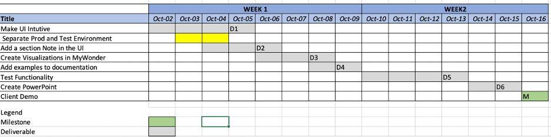

MyWonder

# Project Summary

MyWonder is a big data analytics and visualization platform allowing users to create visualizations from massive files under 10 minutes. The same process would earlier take hours testing the patience of end users leaving them unsatisified with the product.

The current methodology leverages cloud to efficienlty process and distribute files. Users can now upload files from phone and calculate results on the go just before attending meetings.

# Identified Wastes

Waiting : 
- Too much bureaucracy involved to need assistance, one cannot directly contact the desired person of contact to understand the functionality (backend developer in this case)

Defects:
- Terminology and contents used in the user interface do not make it appropriate for demos

Skills:

-  Many people are working on the same tasks which is to create visualiztion, which is not necesssary

# Deliverables

- Make UI intuitive by getting rid of contents and terminology that are counterintuitive

- Add a new section note in the UI allowing users to document what they did

- Create Visualizations on MyDemo along with pointers to how the visualization works

-  Test all the features once after enhancements

- Create powerpoint with screenshots to a few visualization examples and add it to the documentation on website

# Milestone

- Client demo of MyWonder platform on 16th Oct

# Gantt Chart

